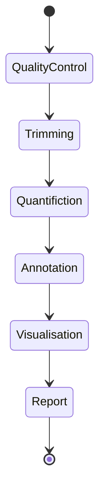

# Efficency of Hand Sanitizers[WIP]

---

## General flow



## Getting Started

### Input

The input files and parameters are specified in `./config/config.yml` and are contained in `./resources/*`.

-

### Output

The output files and parameters are specified in `./config/config.yml` and will be contained in `./pipeline_results/*`.

-

### Rules

- `commons.smk` - Reads samples from samples.tsv, converts the fastq files to a single format.
- `module.smk` - Prints the crucial project configurations.
- `plots.smk` - Runs Python scripts for visualization, particularly bar and other plots.
- `ncbi_download.smk` - Fetches fastq files from [ncbi library](https://www.ncbi.nlm.nih.gov/) **requires nbci_user_address to be set in config.yaml**
- `quality_control.smk` - Operates with FastQC and MultiQC tools.
- `quantification.smk` - Quantifies the abundance of different microbes in the samples.
- `trimming.smk` - Preprocesses the input data by trimming low-quality bases and removing adapters.

### Layout

- `README.md`

- `./config/*` - configuration directory

  - `*/config.yaml` - sample of YAML configuration file, which is presented in **.gitignore**
  - `*/config_sample.yaml` - sample of YAML configuration file

- `./workflow/*` - snakemake primary workflow directory

  - `*/Snakefile` - master snakefile
  - `*/envs/` - snakefiles collection included by the master snakefile
  - `*/logs/` - snakefiles collection included by the master snakefile
  - `*/notebooks/*` - consists of usefull or not notes written by **any contribution of the project**.
  - `*/report/*` - the directory will be contain the result of the `kraken2_analysis` _rule_.
  - `*/rules/*` - the directory contains the pipeline rules
  - `*/scripts/*` - the directory contains the pipeline analysis scripts, python, R and bash scripts.

- `./resources/*` - input data for the pipeline, samples directory

  - `*/samples.tsv` - file consists of sample paths
  - `*/init_samples/*` - the samples represent the DNA sequence result **BEFORE treating fingers with sanitizer**
  - `*/result_samples/*` - the samples represent the DNA sequence result **AFTER treating fingers with sanitizer**

- `results/*` - pipeline results to be commited
  - `trimmed/*` - the directory will be contain the result of trimming the input files.
  - `sorted/*` - the directory will be contain the sorted and indexed transcriptome alignments.

### Installation

Clone the repository:

```bash
git clone https://github.com/dsph-first/hand-sanitizers-efficiency.git
```

### Usage

Create a `config.yml` file based on `config_sample.yaml` to set the input datasets and parameters then issue:

On a server, e.g.:

```bash
snakemake --use-conda -j <num_cores> all
```

Or a particular rule:

```bash
snakemake --use-conda -j <num_cores> rule_name
```

## TODO

- [ ] Add repo permissions and push/merge requirements
- [ ] Write requirements on data: length of samples should be equal in both folders, len(init_samles) === len(result_samples)
- [x] Visuaisation
- [ ]
- [ ]
- [ ] Create plots

## References

1. [Conda](https://conda.io/docs/user-guide/install/index.html).
2. [Snakemake tutorial](https://snakemake.readthedocs.io/en/stable/tutorial/tutorial.html)
3. [FastQC](https://www.bioinformatics.babraham.ac.uk/projects/fastqc/).
   _FastQC generates its reports by evaluating a small subset of the data and extrapolating those findings to the entirety of the dataset. Many of the metrics are only computed on the first 200,000 measurements then are being tracked through the rest of the data._
4. [Trimmonatic](https://academic.oup.com/bioinformatics/article/30/15/2114/2390096)
5. Bracken
6. Kraken2
7. [Roary](https://sanger-pathogens.github.io/Roary/)
