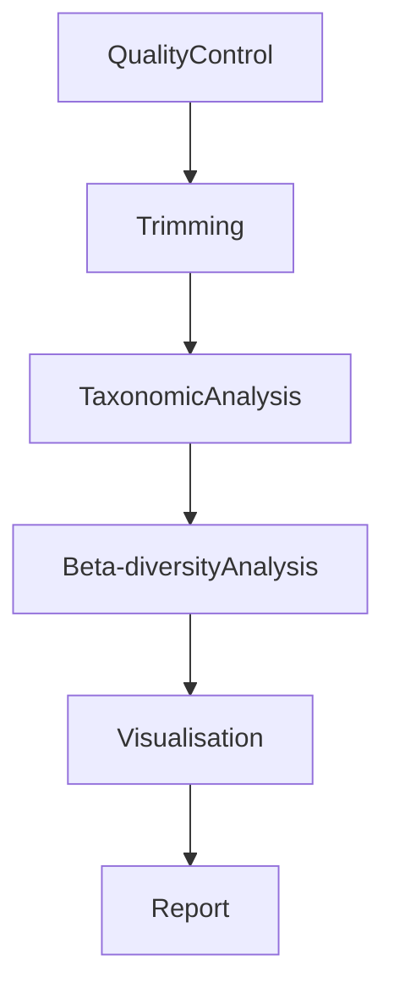

# Efficency of Hand Sanitizers[WIP]

---

## General flow



## Getting Started

### Input

The input files and parameters are specified in `./config/config.yaml` and are contained in `./resources/*`.

-

### Output

The output files and parameters are specified in `./config/config.yaml` and will be contained in `./pipeline_results/*`.

-

### Rules

- `commons.smk` - Reads samples from samples.tsv, converts the fastq.gz files to a single format.
- `module.smk` - Prints the crucial project configurations.
- `plots.smk` - Runs Python scripts for visualization, particularly bar and other plots.
- `ncbi_download.smk` - Fetches fastq files from [ncbi library](https://www.ncbi.nlm.nih.gov/) **requires nbci_user_address to be set in config.yaml**
- `quality_control.smk` - Operates with FastQC and MultiQC tools.
- `quantification.smk` - Quantifies the abundance of different microbes in the samples.
- `trimming.smk` - Preprocesses the input data by trimming low-quality bases and removing adapters.

### Layout

- `README.md`

- `./config/*` - configuration directory

  - `*/config.yaml` - sample of YAML configuration file, which is presented in **.gitignore**
  - `*/config_sample.yaml` - sample of YAML configuration file

- `./workflow/*` - snakemake primary workflow directory

  - `*/Snakefile` - master snakefile
  - `*/envs/` - snakefiles collection included by the master snakefile
  - `*/logs/` - snakefiles collection included by the master snakefile
  - `*/notebooks/*` - consists of usefull or not notes written by **any contribution of the project**.
  - `*/report/*` - the directory will be contain the result of the `kraken2_analysis` _rule_.
  - `*/rules/*` - the directory contains the pipeline rules
  - `*/scripts/*` - the directory contains the pipeline analysis scripts, python and bash scripts.

- `./resources/*` - input data for the pipeline, samples directory

  - `*/samples.tsv` - file consists of sample paths
  - `*/init_samples/*` - the samples represent the DNA sequence result **BEFORE treating fingers with sanitizer**
  - `*/result_samples/*` - the samples represent the DNA sequence result **AFTER treating fingers with sanitizer**

- `results/*` - pipeline results to be commited
  - `trimmed/*` - the directory will be contain the result of trimming the input files.
  - `sorted/*` - the directory will be contain the sorted and indexed metagenome alignments.

### Installation

Clone the repository:

```bash
git clone https://github.com/dsph-first/hand-sanitizers-efficiency.git
```

### Usage

##### DATA

[Dummy data](https://www.ebi.ac.uk/ena/browser/view/PRJNA687773)

**Why these test data are suitable:**

1. The nature of the data. During the project, the bacterial community on the human skin surface before and after the use of sanitizer will be investigated. The test data contain information about the human gut microbiota (i.e., the bacterial community of the gut), which are collected for two groups of people: healthy individuals and those with ASD (Autism Spectrum Disorder).
2. The type of data used for sequencing. It can be of two kinds: whole-genome data and 16S amplicons. For your data, 16S amplicons will be used, due to the information indicated in your sequencer. The test data are also 16S amplicons, which is crucial for the task at hand.
3. The final task is to compare the composition of the bacterial community before and after the application of the sanitizer. That means there should be the ability to divide the samples into two clear groups. For the test data, these groups will be the sick (patients with illnesses) and healthy patients.
4. The volume of data. The test data have many samples, which will allow for a full exploration and evaluation of the methods used.

---

1. First QC with `FASTQC`

Quality control is carried out using the FastQC program. As a result of the program,
an html file and a zip file will be obtained for each sample. We don't need the zip file, we can delete it.
The html file contains the following items.

Steps:

1. Basic Statistics. It contains basic information about the sample: filename, filetype, total sequences, total bases, encoding, sequence length, %GC
2. Per base quality
3. Per sequence quality scores
4. Per base sequence content
   The result of this section can be ambivalent in case of using 16S rRNA or DNA aplicons. The lines for each base must be parallel, but this condition is fulfilled only for genome-wide samples, in the case of 16S amplicon this is practically not found.
5. Per sequence GC content
   This section is rather important for understanding quality control. It should be observed before and after trimming. If there are some troubles with GC-content after trimming, we should to check for contamination by aligning samples to the human genome (or another genome depending on the samples).
6. Per base N content
7. Sequence Length Distribution
8. Sequence Duplication Levels
9. Overrepresented sequences
   This section must be empty for genome-wide samples, in the case of 16S amplicon this is practically not found. It will become better after trimming data.
10. Adapter Content

```bash
python ./workflow/scripts/fastqc
```

**Results are going to be stored by the path: ./resources/output/fastqc_raw**

2. Trimming with `trimmomatic`

Any sequencer makes mistakes, so it is almost impossible to avoid the trimming stage. Trimmomatic will help us. Here you can read the manual (http://www.usadellab.org/cms/?page=trimmomatic). To run this program, use the script "trimmomatic".
After trimming data we should recheck quality data using FastQC.

```bash
python ./workflow/scripts/trimmomatic
```

**Results are going to be stored by the path: ./resources/output/fastqc_trimmed**

3. Checking for contamination

This is a mandatory step in data quality control. Especially when working with microbiota, as it is very easy to contaminate by human DNA during the collecting data. This can completely change the results of subsequent sample analyses. You can use bwa or bowtie2 for this.
For this step you need indexed human genome and one of these programs. If you don't have indexed human genome, you should do index it by yourself.
As the result of such mapping we will have several output files. Files with fastq.gz extension for unaligned sequences (which are not contaminated by human DNA) and files with sam extension for the general result. For our tasks we need only fastq.gz files and sam files can be deleted.
To run this program use script "mapping_data"

```bash
python ./workflow/scripts/mapping_data
```

and after

4. Renaming

To get neccesary file-extension.

```bash
python ./workflow/scripts/renaming
```

**Results are going to be stored by the path: ./resources/output/fastqc_mapping**

5. Analysis of the results

Additionaly we should check changing of total bases and total sequences during all three stages (raw data - trimmed data - data after contamination checking). It should keep about 60-70% from the first stage to the third stage(check out the `./Result_analysis.ipynb` script).

```bash
jupyter notebook && open Result_analysis.ipynb
```

---

Create a `config.yaml` file based on `config_sample.yaml` to set the input datasets and parameters then issue:

On a server, e.g.:

```bash
snakemake --use-conda -j <num_cores> all
```

Or a particular rule:

```bash
snakemake --use-conda -j <num_cores> rule_name
```

## TODO

- [x] Add repo permissions and push/merge requirements
- [x] Find public data
- [x] Using FastQC for raw data
- [x] Trimming data and rechecking by FastQC
- [x] Mapping data and final quality control
- [ ] Wrap the python scripts into Snake rules
- [ ] Conduct the taxonomy analysis using Kraken and Braken
- [ ] Make beta-diversity analysis for `*/init_samples/*` and `*/result_samples/*`
- [ ] Create plots

## References

1. [Conda](https://conda.io/docs/user-guide/install/index.html).
2. [Snakemake tutorial](https://snakemake.readthedocs.io/en/stable/tutorial/tutorial.html)
3. [FastQC](https://www.bioinformatics.babraham.ac.uk/projects/fastqc/).
   _FastQC generates its reports by evaluating a small subset of the data and extrapolating those findings to the entirety of the dataset. Many of the metrics are only computed on the first 200,000 measurements then are being tracked through the rest of the data._
4. [Trimmonatic](https://academic.oup.com/bioinformatics/article/30/15/2114/2390096)
5. [Bracken] (https://ccb.jhu.edu/software/bracken/index.shtml?t=manual)
6. [Kraken2] (https://github.com/DerrickWood/kraken2/wiki/Manual)
7. [Roary](https://sanger-pathogens.github.io/Roary/)
